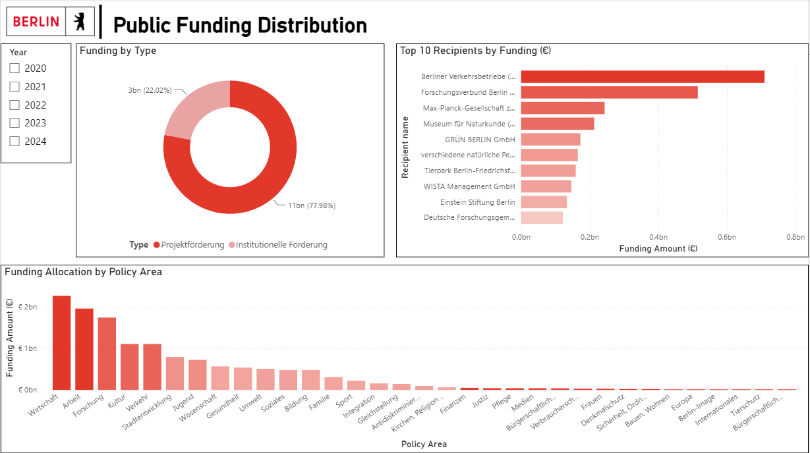

# Berlin Public Funding Priorities (2020–2024)

## Project Overview

This project analyzes public funding allocations in Berlin between 2020 and 2024 using 57,469 grant records from the Berlin Open Data Portal.

The objective is to understand how public resources were distributed across policy areas, recipients, and funding mechanisms, as well as how funding priorities evolved over time.

The analysis combines exploratory data analysis in Python with an interactive Power BI dashboard to identify funding patterns, concentration effects, and shifts in policy priorities during the post-pandemic period.

## Research Question

How did Berlin's public funding priorities evolve between 2020 and 2024?

More specifically:

- Which policy areas received the largest share of public funding?
- Who were the main funding recipients?
- What funding mechanisms dominated Berlin's funding model?
- Which policy areas gained or lost importance over time?

## Dataset

Source: Berlin Open Data Portal

- 57,469 grant records
- Period 2020–2024
- 34 policy areas
- Institutional and project funding

## Main variables used:

| Variable | Description |
|-----------|------------|
| betrag | Funding amount (€) |
| politikbereich | Policy area |
| zweck | Funding purpose |
| empfaengerid | Recipient identifier |
| name | Recipient name |
| geber | Funding provider |
| art | Funding type |
| jahr | Year |

## Tools Used

- Excel
- Python (Pandas, Numpy, Matplotlib)
- Google Colab
- Power BI
- GitHub

## Key Findings

1. Funding is concentrated among a limited number of recipients

A relatively small number of organizations account for a substantial share of total funding, highlighting the concentration of public resources among key institutions.

2. Project funding dominates Berlin's funding model

Approximately 78% of total funding was distributed through project-based funding schemes, while institutional funding represented around 22%.

3. Economic development gained importance over time

The policy area Wirtschaft increased its share of total funding by approximately 11 percentage points between 2020 and 2024.

4. Urban development lost relative importance

Stadtentwicklung experienced the largest decline in funding share during the period.

5. Research remained a strategic funding priority

Funding allocated to research-related activities increased its relative importance over time.

## Dashboard Structure

1.Executive Overview

Provides a high-level summary of funding volume, recipients, funding providers, policy areas, and funding purposes.

2.Funding Distribution

Explores how funding is allocated across policy areas, funding types, and recipient organizations.

3.Trends & Evolution

Analyzes how Berlin's funding priorities changed between 2020 and 2024, highlighting shifts in policy area importance and funding mechanisms.

## Dashboard Preview

### Executive Overview

### Funding Distribution

### Trends & Evolution

## Skills Demonstrated

- Data Cleaning
- Exploratory Data Analysis
- Data Visualization
- Dashboard Design
- DAX
- Public Policy Analysis
- Storytelling with Data

## Future Improvements

- Geographic analysis
- Inflation-adjusted funding analysis
- Recipient segmentation

## Repository Structure

berlin-public-funding-analysis │
├── dashboard 
│ └── Berlin_Public_Funding.pbix 
│ 
├── notebooks 
│ └── Berlin_Funding_EDA.ipynb 
│ ├── images 
│ ├── overview.png 
│ ├── distribution.png 
│ └── trends.png 
│ ├── README.md
└── requirements.txt
